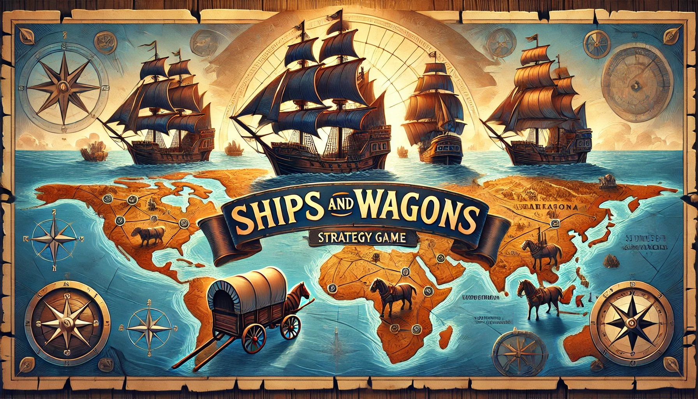

# Ships and Wagons

## Game Concept

| Title       | Continental Traders                                                                 |
|-------------|--------------------------------------------------------------------------------------|
| Genre       | Strategy / Simulation                                                                |
| Objective   | To build a successful trading empire by effectively managing resources, transport routes, and trade goods. Players aim to outmaneuver competitors and dominate the market. |

## Gameplay Mechanics

Map Setup: The game takes place on a fictional continent divided into various regions, each with unique resources, production capabilities, and market demands.

Modes of Transport: Players can purchase and upgrade various types of transport:
- Ships: For sea routes, carrying large volumes but slower.
- Wagons: For land routes, faster but limited in capacity.

Trade Goods: Various goods like spices, textiles, minerals, and livestock. Each has different buying and selling prices that fluctuate with market trends.

Economy System: Dynamic market prices based on supply and demand. Events like droughts, wars, or discoveries can affect market prices and availability.

Competitors: AI-controlled or player opponents with similar goals.

## Features
Route Planning: Players must plan the most efficient routes considering distance, cost, and current geopolitical situations.

Resource Management: Balance between investing in more vehicles, hiring skilled personnel, and buying goods cheaply.

Upgrades: Invest in technology upgrades for ships and wagons, such as increased speed, capacity, or durability.

Diplomacy and Contracts: Negotiate trade agreements or engage in diplomacy to gain trading rights or advantages.

Challenges: Face random events like pirate attacks, customs inspections, or transportation mishaps.

## Progression and Levels

Starting Point: Players start with a small amount of capital and a single mode of transportation.

Expansion: As players earn money, they can expand their fleet, explore new trade routes, or even sabotage competitors.

Victory Conditions: Players can win by achieving monopolistic control, reaching a certain net worth, or fulfilling specific historical missions.

